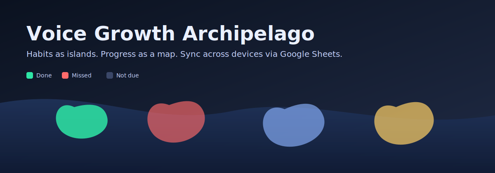
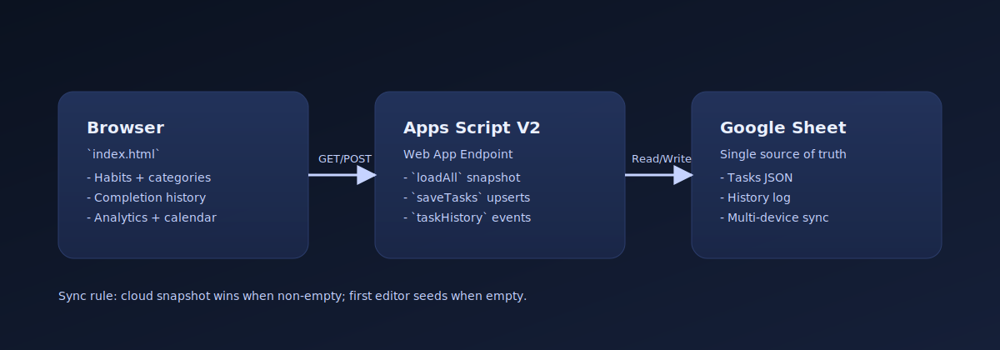
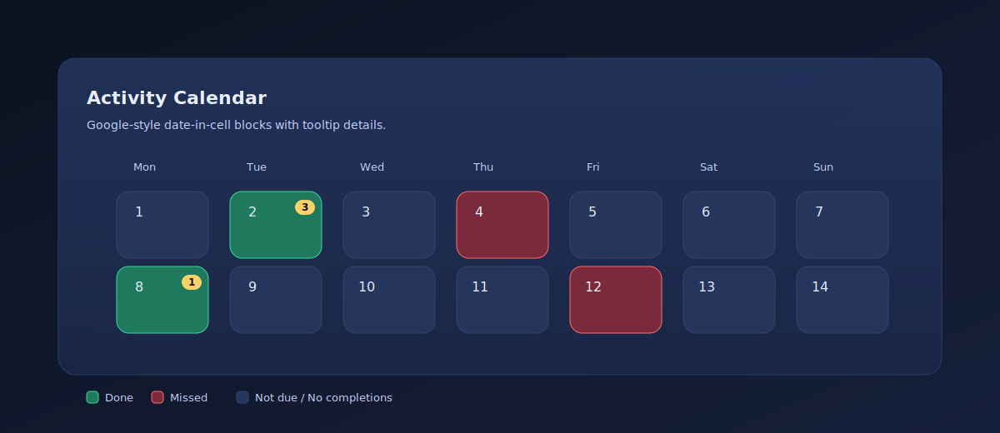

# Voice Growth Archipelago

  

Habits as islands. Progress as a map.

This is a single-file web app (`index.html`) for tracking daily routines and skill categories, with **reliable cross-device sync** via **Google Sheets + Apps Script**. It’s designed to feel lightweight (open in any browser), while still giving you “real product” features like archive-safe habit lifecycle, a Google-style activity calendar, and consistent analytics windows.

  

## Table of contents

- [What it is](#what-it-is)
- [Key features](#key-features)
- [How it works](#how-it-works)
- [Quick start](#quick-start)
- [Deploy to your site](#deploy-to-your-site)
- [Troubleshooting](#troubleshooting)
- [Credits](#credits)

## What it is

- A habit tracker you can host anywhere (GitHub Pages, Netlify, your own domain).
- A consistent “source of truth” setup where Google Sheets stores:
  - Habit definitions (name, schedule, category, colors, lifecycle status)
  - Completion history (events over time)
- A Progress section that supports `7/30/90` presets and a custom range across all charts.

## Key features

### Today
- Island-based habit tracking with one-tap complete/uncomplete.
- Undo toast for quick recovery from accidental taps.
- Day scopes:
  - `Standard Day`: all active due habits.
  - `Lite Day`: only core due habits.
- Constellation celebration when all core due habits are completed.

### Progress
- Preset windows: `7`, `30`, `90` days, plus `Custom`.
- Scope filter: `All Habits` vs `Core Habits` and optional `Include archived`.
- Activity Calendar (Google-style date-in-cell blocks):
  - All-habits intensity mode with daily completion count badges
  - Single-habit done/missed/not-due mode
  - Monday-first week layout and 3-letter weekday labels (`Mon Tue ...`)
  - Month paging for long ranges

  

### Categories (skills)
- One category per habit, fully user-controlled from Add/Edit Habit.
- Analytics aggregate dynamically from the categories you actually use (no hardcoded “Mindfulness/Discipline/Learning”).

### Habit Lifecycle
- Add/edit habits with frequency, days, category, and color.
- Remove is two-step and safe:
  - Archive habit (default)
  - Delete permanently
- Re-adding a habit with the same name as an archived one offers restore.
- Archived history is preserved and can be included in analytics.

### Sync (cross-device)
- Google Sheets is the authoritative store for habit definitions and completion history.
- The app loads a cloud snapshot on startup and refreshes on tab focus.
- Optional `?uid=<your-id>` isolates data per user (defaults to a shared personal id).
- LocalStorage remains a fallback for transient network failures.

## How it works

- **Frontend**: `index.html` renders Today + Progress, and stores local UI state.
- **Backend**: Apps Script exposes a simple web endpoint that reads/writes JSON into your Google Sheet.
- **Conflict policy**: “latest editor wins” when two devices edit close together (simple and reliable for personal use).

For the exact script contract and deployment steps, see `GOOGLE_APPS_SCRIPT_V2.md`.

## Data model notes

Each habit task now supports lifecycle fields:
- `status`: `active | archived | deleted`
- `createdAt`, `archivedAt`, `deletedAt`

Backward compatibility is preserved:
- Missing status defaults to `active`.
- Missing category defaults to `Uncategorized`.

## Quick start

1. Deploy the Apps Script web app (see `GOOGLE_APPS_SCRIPT_V2.md`).
2. Set `GOOGLE_SCRIPT_URL` in `index.html` to your deployed endpoint.
3. Open `index.html` in a browser.

Verify the backend quickly:
- Open `.../exec?action=loadAll&userId=habit-app-primary-user`
- Expect JSON containing `tasks` and `taskHistory`.

## Deploy to your site

- Any static hosting works since this is a single HTML file.
- Recommended: GitHub Pages (simple), Netlify (fast), or your own domain (drop-in file).
- After deploying, open the same URL on phone + desktop and edits should sync after reload/focus.

## File structure

- `index.html` — Main app (UI + state + rendering + task lifecycle).
- `GOOGLE_APPS_SCRIPT_V2.md` — Backend script contract for tasks/completions sync.

## Troubleshooting

- Data mismatch across devices:
  - Verify same `uid` is used.
  - Verify the same Apps Script deployment URL is configured.
- Custom date not updating charts:
  - Ensure `From <= To` and end date is not in the future.
- Habit missing after removal:
  - Check if it was archived (toggle `Include archived` in Progress).

## Credits

- Icons: [Heroicons](https://heroicons.com/)
- Charts: [Chart.js](https://www.chartjs.org/)
- CSS: [Tailwind CSS](https://tailwindcss.com/)
